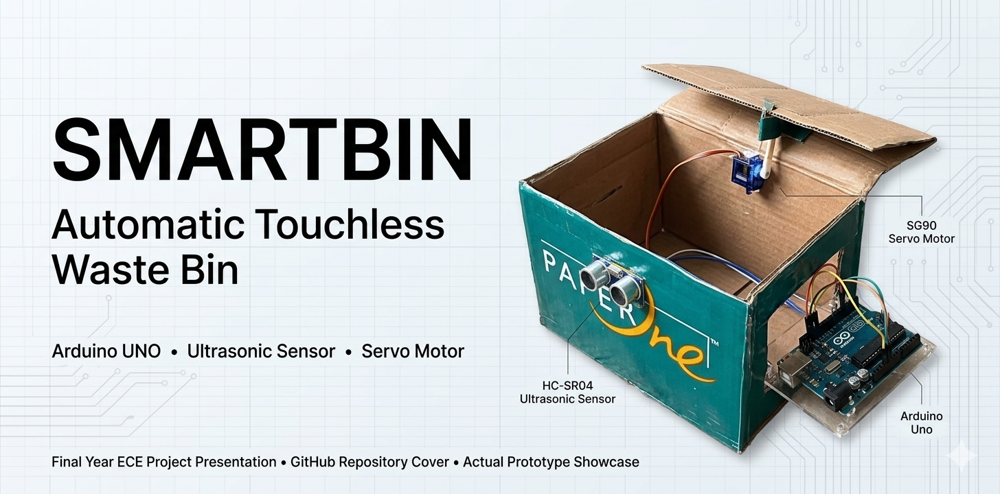

<p align="center">
  
</p>

# ♻️ SmartBin – IoT Based Automatic Touchless Waste Management System

<p align="center">


</p>

---

## 📌 Project Overview

SmartBin is an Arduino-based automated waste management system designed to improve hygiene through touchless waste disposal.

The system utilizes an HC-SR04 Ultrasonic Sensor to detect nearby objects and automatically actuates a Servo Motor to open and close the lid without physical contact.

This project demonstrates the practical application of:

* Embedded Systems
* Sensor Interfacing
* Automation
* Smart Waste Management
* IoT Concepts

---

## 🎥 Demonstration

Demo Video:

```text
assets/videos/demo_video.mp4
```

---

## 📷 Circuit Diagram


---

## 🚀 Key Features

✅ Touchless Waste Disposal

✅ Automatic Lid Operation

✅ Real-Time Distance Detection

✅ Low-Cost Implementation

✅ Easy Deployment

✅ Energy Efficient

✅ Hygienic Waste Handling

---

## 🏗️ System Architecture

Object Detection
↓
HC-SR04 Ultrasonic Sensor
↓
Arduino UNO
↓
Decision Logic
↓
Servo Motor
↓
Automatic Lid Operation

---

## ⚙️ Hardware Components

| Component                 | Quantity    |
| ------------------------- | ----------- |
| Arduino UNO               | 1           |
| HC-SR04 Ultrasonic Sensor | 1           |
| SG90 Servo Motor          | 1           |
| Breadboard                | 1           |
| Jumper Wires              | As Required |
| Power Supply              | 1           |

---

## 🔌 Pin Connections

### Ultrasonic Sensor

| HC-SR04 | Arduino UNO |
| ------- | ----------- |
| VCC     | 5V          |
| GND     | GND         |
| TRIG    | D9          |
| ECHO    | D10         |

### Servo Motor

| Servo  | Arduino UNO |
| ------ | ----------- |
| Signal | D11         |
| VCC    | 5V          |
| GND    | GND         |

---

## 🧠 Working Principle

1. Ultrasonic sensor continuously measures distance.
2. Object enters predefined detection range.
3. Arduino processes sensor data.
4. Servo motor opens lid automatically.
5. Lid remains open for a predefined duration.
6. Lid closes automatically.
7. System resets for the next detection cycle.

---

## 💻 Software Requirements

* Arduino IDE
* Servo Library

---

## 📚 Libraries Used

The project uses the following Arduino libraries:

| Library | Purpose |
|----------|----------|
| Servo.h | Controls the servo motor |

### Installing the Library

1. Open Arduino IDE
2. Navigate to Sketch → Include Library → Manage Libraries
3. Search for "Servo"
4. Install the official Arduino Servo library

---

## ▶️ Installation

### Clone Repository

```bash
git clone https://github.com/nithingoud78/SmartBin.git
```

### Open Project

```text
src/SmartBin_Code.ino
```

### Upload

* Select Arduino UNO
* Select correct COM Port
* Upload Code

---

## 📂 Project Structure

```text
SmartBin
│
├── Assets
│   └── videos
│
├── Docs
│   ├── Circuit_Diagram.png
│   └── Project_Report.pdf
│
├── Hardware
│   └── components_list.md
│
├── Src
│   └── SmartBin_Code.ino
│
└── README.md
```

---

## 📊 Applications

* Smart Homes
* Hospitals
* Offices
* Educational Institutions
* Public Infrastructure
* Smart Cities

---

## 🔮 Future Enhancements

* IoT Cloud Monitoring
* Waste Level Detection
* Mobile Application Integration
* Solar Powered Operation
* Smart Segregation Mechanism
* GSM Notification System

---

## 📄 Documentation

Project Report:

```text
Docs/Project_Report.pdf
```

---

## 👨‍💻 Author

### K. Nithin Kumar Goud

Bachelor of Engineering (Electronics and Communication Engineering)

Areas of Interest:

* Embedded Systems
* Robotics
* Internet of Things (IoT)
* Autonomous Vehicles
* Edge AI

GitHub:
https://github.com/nithingoud78

---

## ⭐ Support

If you found this project useful:

⭐ Star the repository

🍴 Fork the repository

📢 Share with others

---

## 📜 License

This project is licensed under the MIT License.
